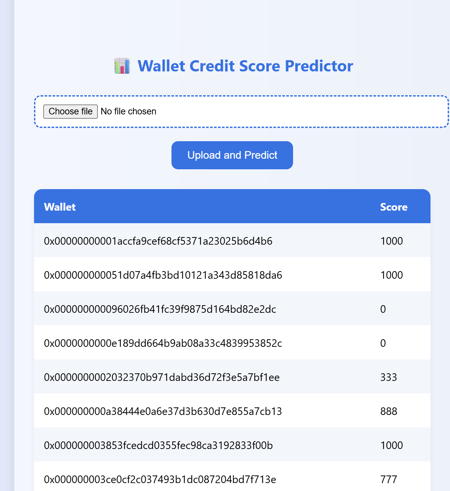
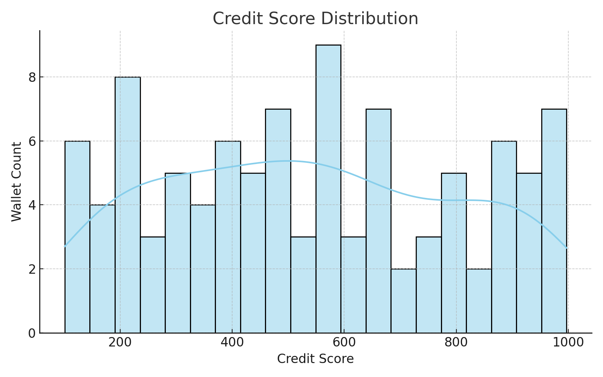
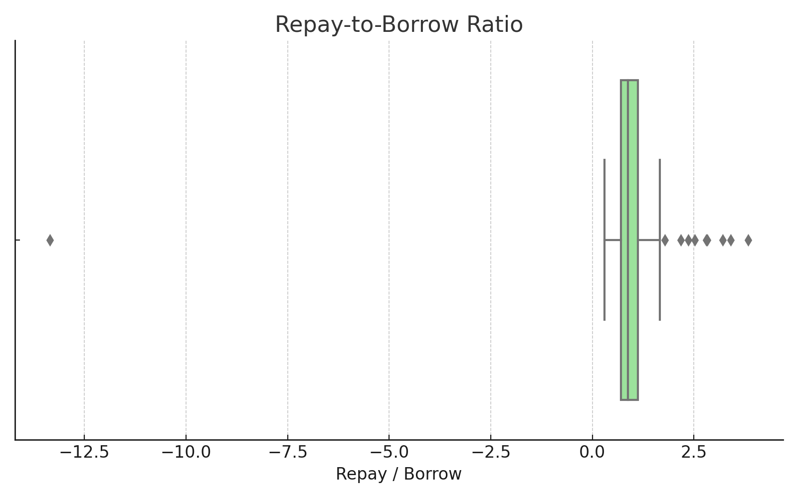
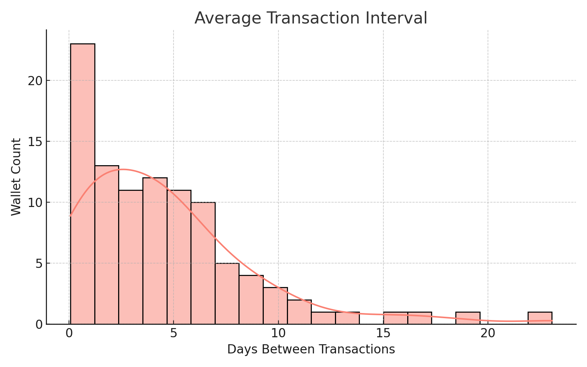

# 🖊️ Smarter Credit Scores from Blockchain Transactions

## 🔍 Overview

**Aave Wallet Credit Score Predictor** is a machine learning-powered system that analyzes Aave V2 wallet transaction history and assigns a credit score (0–1000) based on wallet behavior. This allows DeFi lenders to evaluate trustworthiness using on-chain behavior, without relying on traditional finance data.

---

## ⚙️ How it Works

1. User uploads a `.json` file containing Aave V2 wallet transactions.
2. Flask backend extracts behavioral features (e.g., deposit frequency, repay/borrow ratio).
3. The KMeans model clusters wallet behavior.
4. Clusters are mapped to a 0–1000 credit score scale.
5. Scores are returned and displayed in the browser.

---

## 🧠 ML Model Used

- **Model:** KMeans Clustering (Unsupervised)
- **Scaler:** StandardScaler (to normalize inputs)

**Features Extracted:**
- Total number of transactions  
- USD amounts deposited/borrowed/repaid  
- Count of repay, borrow, deposit  
- Repay-to-borrow ratio  
- Average transaction interval  
- Number of liquidations

---

## 💡 Features

- Upload and process `.json` Aave wallet data  
- Frontend preview of credit scores in tabular format  
- Real-time predictions powered by Flask API  
- Beautiful and animated frontend  

---

## 🚀 How to Run

### 🧩 Backend Setup
```bash
cd backend
python -m venv venv
venv\Scripts\activate       # On Windows
pip install -r requirements.txt
python app.py
```

### 🎨 Frontend Setup
```bash
cd frontend
python -m http.server 5500
```
> Then open your browser at: [http://localhost:5500/index.html](http://localhost:5500/index.html)

---

## 📂 Folder Structure

```
aave-credit-score/
│
├── backend/
│   ├── app.py
│   ├── utils.py
│   ├── model.pkl
│   ├── scaler.pkl
│   └── requirements.txt
│
├── frontend/
│   └── index.html
│
├── notebooks/
│   ├── eda.ipynb
│   └── model_training.ipynb
│
├── data/
│   └── transactions_sample.json
│
├── assets/
│   ├── sample_output.png
│   ├── score_distribution.png
│   ├── repay_vs_borrow.png
│   └── tx_interval.png
│
├── README.md
└── analysis.md
```

---

## 🖼️ Sample Output Screenshot

This shows the predicted scores from a sample wallet upload:



---

## 📈 EDA Visualizations

### 1. Credit Score Distribution  
Shows how credit scores are distributed among wallets.  


### 2. Repay vs Borrow Ratio  
Box plot of the repay-to-borrow ratio across wallets.  


### 3. Transaction Interval  
Histogram of average number of days between wallet transactions.  


---

## 🥺 How to Test

1. Run the backend (`python app.py`) and confirm it says `Running on http://127.0.0.1:5000`
2. Serve frontend (`python -m http.server 5500`) and open in browser
3. Upload `transactions_sample.json` or your own Aave wallet file
4. Wait for credit score results

---

Built with ❤️ using Python, Flask, HTML/CSS, and Machine Learning.